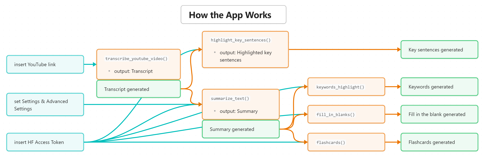

# ✍️ Summarizer for Learning Documentation

Check out the app [here](https://reflection777-summarizer-for-learning.hf.space/?__theme=dark).

## 1. User Manual

1. Insert your <a href="https://huggingface.co/settings/tokens" target="_blank">🤗 Hugging Face Access Token</a> in the textbox located as shown.

  

2. Insert a YouTube link in the textbox located as shown. The YouTube video must be able to have its caption on.

  
  
  - Or you can use the example YouTube links the bottom of the page to try out the app:
  - 

3. Set the Settings according to your need.

  

4. Set the Advanced Settings according to your need. Slide the Temperate or/and tick the `do_sample` checkbox to your need.

  

5. Summarize it by clicking the Summarize button.

  

6. To use the `Key sentence`, `Keywords`, `Fill in the blank`, or `Flashcards` feature, click on the desired tab and click the Generate button after the summarization process is finished.

  

  

  
The result should similiar like these:

    
  - 
  - 
  - 
  - 
  

## 2. How It Works

  

## 3. Concept
The goal of the app was for learners to **(1)retain** long-text information better, and also make the important points **(2)memorable**. To do that the app takes a long text then summarize it, extract its keywords, and quiz the learner.

## 4. Additional Note
The app is a pet project and was made for me to learn more about summarization in NLP. The summarization methodology was derived from [Amin Kamali's summarizer app](https://huggingface.co/spaces/smakamali/summarize_youtube). I am thankful for Amin for publishing his material online for me to learn from it.

Apart from the that, some of the features in the app are still under development due to some contraints. The LLM used for this summarization is `tiiuae/falcon-7b-instruct` that is primarily intended for a chat-based scenario or for text generation. Because of that, small part of the summarized output may include information not inlucuded in the original text. This problem will be looked into further.

<!---Check out the configuration reference at https://huggingface.co/docs/hub/spaces-config-reference-->
